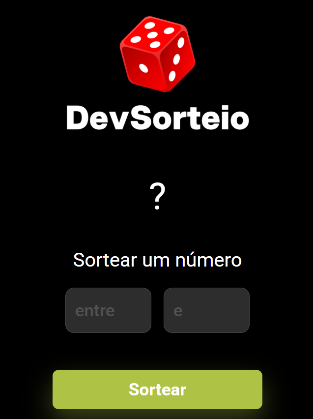

# 🎲 Projeto Random

Este é um projeto simples de **sorteador de números aleatórios**, desenvolvido utilizando **HTML**, **CSS** e **JavaScript**. Ideal para estudos e prática de conceitos fundamentais de front-end.

## 🚀 Funcionalidades

- Geração de números aleatórios dentro de um intervalo definido pelo usuário
- Interface simples e responsiva
- Validação dos campos de entrada
- Limpeza automática dos campos após o sorteio

## 📸 Demonstração

<<<<<<< HEAD
 <!-- Coloque uma imagem do projeto ou use GitHub Pages para demonstrar -->
=======
 <!-- Coloque uma imagem do projeto ou use GitHub Pages para demonstrar -->
>>>>>>> b7ac69b2618f032648b0ea142f1145d74984dc44

## 🛠️ Tecnologias Utilizadas

- HTML5
- CSS3
- JavaScript (ES6)

## 📁 Estrutura de Arquivos

```
Projeto-Random/
├── index.html
├── style.css
└── script.js
```

## 🧠 O que aprendi

- Manipulação do DOM com JavaScript puro
- Eventos de formulário
- Lógica de geração de números aleatórios
- Organização básica de um projeto web

## 📌 Como usar

1. Clone o repositório:
   ```bash
   git clone https://github.com/rafaelqueiroz11/Projeto-Random.git
   ```
2. Abra o arquivo `index.html` em seu navegador.

## 🧪 Melhorias futuras

- Adicionar animações com CSS
- Exibir histórico de números sorteados
- Responsividade para dispositivos móveis

## 🙋‍♂️ Autor

**Rafael Neves Queiroz**  
[LinkedIn](https://www.linkedin.com/in/rafael-neves-queiroz)  
[GitHub](https://github.com/rafaelqueiroz11)

---

⭐ Se você gostou do projeto, deixe uma estrela no repositório!
